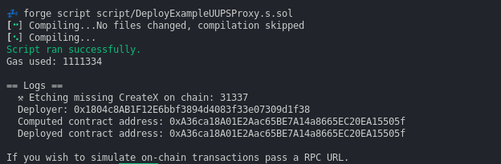
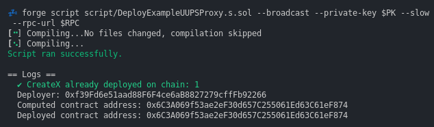
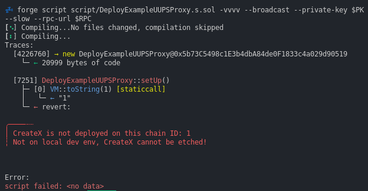
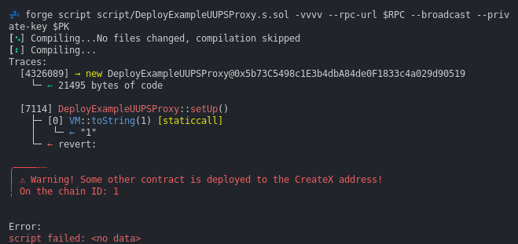

# CreateX-Forge Deployment Script

This package allows the use of the fantastic [`CreateX`](https://github.com/pcaversaccio/createx) CREATE3 factory within Foundry Forge projects.

The goal of this repository is to provide CreateX factory in a lean and practical way.

In general, the script checks if CreateX factory is already deployed on the chain. If not, it will etch (deploy) it when running within a Forge test environment (chainID = 31337), making it easier to write and debug deployment solidity scripts.

It sets the `CreateX` object for scripting use with the functions described in: https://github.com/pcaversaccio/createx#available-versatile-functions

# How to use

Install into your initiated Foundry project like any other dependency:

```bash
forge install radeksvarz/createx-forge
```

Add to your deployment script initial setup:

```solidity
...
import {CreateXScript} from "createx-forge/script/CreateXScript.sol";
...

contract MyDeployScript is Script, CreateXScript {
...

function setUp() public withCreateX {
    ...

```

And use within the `run()` part:

```solidity
    vm.startBroadcast();
    ...

    // Prepare the salt
    bytes32 salt = bytes32(abi.encodePacked(msg.sender, hex"00", bytes11(uint88(SOME_SALT))));

    // Calculate the predetermined address of the contract
    address computedAddress = computeCreate3Address(salt, msg.sender);

    // Deploy using CREATE3
    address deployedAddress = create3(salt, type(MyContract).creationCode);

    // Check to make sure that contract is on the expected address
    require(computedAddress == deployedAddress);

    ...
```

_Note: Inheritance from Forge's `Script` is optional, as it is already inherited by `CreateXScript`._

### Ouput when running deployment script during development



### Ouput when running deployment script towards public chains



### See these deployment script examples for more details

- [`Deployment example`](./script/DeployExampleCounter.s.sol) of the basic Counter contract
- [`Deployment example`](./script/DeployExampleUUPSProxy.s.sol) of the combo - UUPS Proxy with ERC20 implementation

# FAQ

## Why this package?

A) Check and find out if the CreateX that is deployed on your chain exists and has the correct runtime bytecode.

B) Use CreateX locally in the Forge project during development.

C) `CreateX.computeCreate3Address()` needs a 'guarded' salt for the correct calculation. Unfortunately deployed CreateX `_guard()` function is not exposed. This script simulates this function with `computeCreate3Address(bytes32 salt, address deployer)` for the CREATE3 case.

D) CreateX repo installs 19+ MB of CreateX supporting code into your project.

E) It also affects forge remappings by adding the following packages which are not needed for the CreateX factory already deployed.

```
💤 forge remappings
@openzeppelin/contracts/=lib/createx/lib/openzeppelin-contracts/contracts/
createx/=lib/createx/src/
ds-test/=lib/forge-std/lib/ds-test/src/
erc4626-tests/=lib/createx/lib/openzeppelin-contracts/lib/erc4626-tests/
forge-std/=lib/forge-std/src/
openzeppelin-contracts/=lib/createx/lib/openzeppelin-contracts/
openzeppelin/=lib/createx/lib/openzeppelin-contracts/contracts/
solady/=lib/createx/lib/solady/
```

The CreateX-Forge package is much smaller with minimal dependencies.

## Detection does not work with explicit local Anvil

> [!WARNING] Etching (deploying non existent factory) is not supported towards local explicit Anvil execution with default chainID 31337
>
> This leads to a strange behaviour towards Anvil when Anvil does not have CreateX predeployed (seamingly correct transactions in the forge simulation even when broadcasted).

Start Anvil with a different chainID, e.g. `anvil --chain-id 1982` to simulate a correct behaviour of missing CreateX.

## What if the CreateX is not deployed on the target chain?

This will be the output:



Please, follow the instructions on the CreateX github for the new deployments: https://github.com/pcaversaccio/createx#new-deployments

## What if these is some other contract deployed on the CreateX address?

This is very unlikely - see the discussion: https://github.com/pcaversaccio/createx/discussions/61#discussioncomment-7937359

The script would produce this output:



# Development

This project uses [Foundry](https://getfoundry.sh). See the [book](https://book.getfoundry.sh/getting-started/installation.html) for instructions on how to install and use Foundry.

# License

MIT
